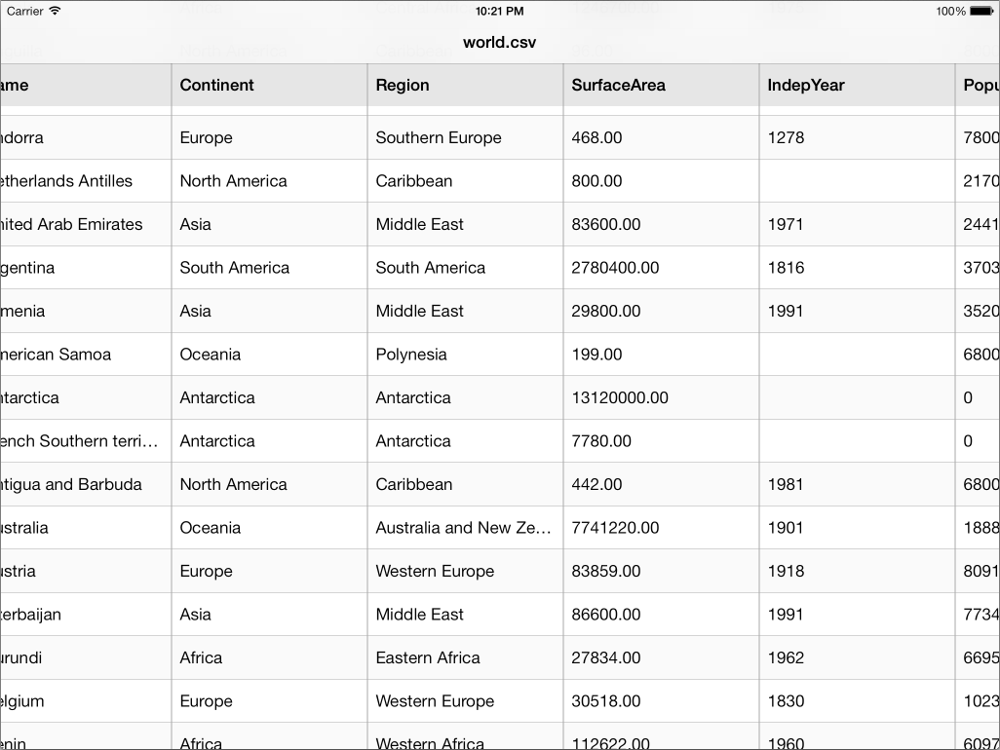

LJCollectionViewTableLayout
===========================

Custom UICollectionViewLayout for displaying items in a two dimensional data table (rows & columns).




## Usage

First things first, your data *must* be tabular. The following two prerequisites must be true:
- You know how many rows and columns need to be displayed.
- You can address each item/cell using a row & column index.
If this is the case then everything else should go pretty smoothly.

Adding the layout to a collection depends on how you create the view. If you alloc+init it programmatically then you can simply create the layout object there and pass it to the collection's initWithFrame:collectionViewLayout: method. This is also a good time to set some of the layout's reference values.

```objective-c

LJCollectionViewTableLayout *layout = [LJCollectionViewTableLayout new];
...
UICollectionView *collection = [[UICollectionView alloc] initWithFrame:main.bounds
                                                  collectionViewLayout:layout];
												  
```

If your collectionView comes from a nib or storyboard then the layout class can be specified in interface builder. Drill down on the Collection View object to reveal the layout object. Select the layout and change its class to LJCollectionViewTableLayout.


Now you're ready for some data! LJCollectionViewTableLayout extends the dataSource protocol to ask for two key values:
- number or rows
- number of columns

This is in addition to the normal collectionView:numberOfItemsInSection: method which is still required. The value returned here *must* match the number of rows * number of columns. If it doesn't, the resulting behavior is undefined and your device may or may not turn evil. LJCollectionViewTableLayout includes a helper method to calculate the number of items for you but it's not strictly necessary.

```objective-c

- (NSInteger)collectionView:(UICollectionView *)collectionView
     numberOfItemsInSection:(NSInteger)section {
    return [LJCollectionViewTableLayout numberOfItemsForTableWithColumnCount:numberOfColumns
                                                                    rowCount:numberOfRows];
}

- (NSInteger)collectionView:(UICollectionView *)collectionView
                     layout:(UICollectionViewLayout *)collectionViewLayout
numberOfRowsForTableInSection:(NSInteger)section {
    return numberOfRows;
}

- (NSInteger)collectionView:(UICollectionView *)collectionView
                     layout:(UICollectionViewLayout *)collectionViewLayout
numberOfColumnsForTableInSection:(NSInteger)section {
    return numberOfColumns;
}

```

See the included Example project for more.


## Requirements

iOS 6.0 is required for UICollectionView.
LJCollectionViewTableLayout is fully ARC compliant because ARC is awesome.


## ToDo

- Implement Sections. This is partially done but still needs a bit more work.
- More customization and delegate options.
- Performance. It runs decently now but it could be better.
- Animation & transition support.


## License

LJCollectionViewTableLayout is available under the MIT license. See the LICENSE file for more info.
